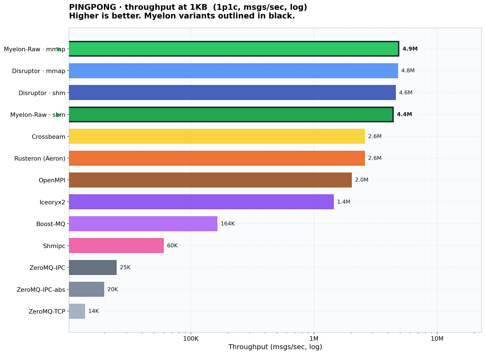
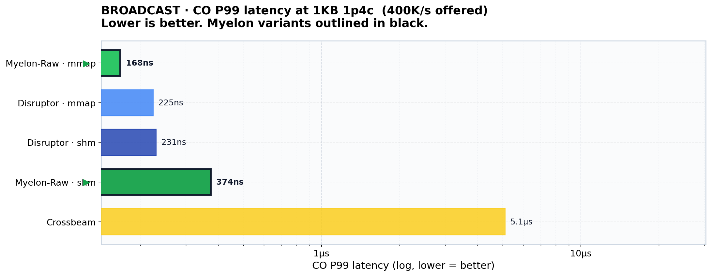
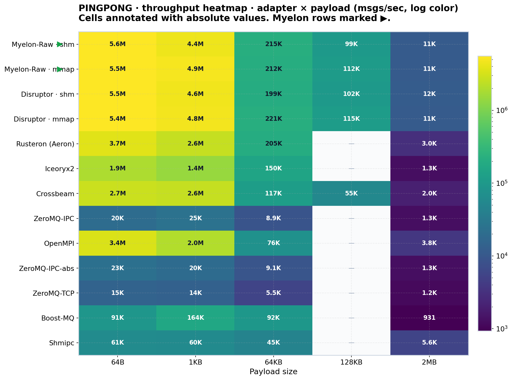

<p align="center">
  
</p>

# myelon

Ultra-low-latency and high-throughput multiprocess transport stack over SHM and mmap ring buffers on Linux and macOS.

Dr Bill Dally is working on shaving nanoseconds by shrinking the distance data has to travel (on-chip wires, off-chip PHYs, memory-to-compute) and stripping overhead out of the path. System software should be just as serious about stripping copies, wakeups, coordination, and communication distance out of its own path.

`myelon` borrows its name from the Greek root behind the spinal cord: the signal path between brain and body. Wrapped in myelin, that cord exists to move impulses fast and clean. This crate tries to do the same for processes: give independent OS processes a low-latency fabric over SHM and mmap, with as little copying, waiting, and coordination drag as possible.

`myelon` is the default crate in this repository. It builds on top of `disruptor-mp`, which extends LMAX Disruptor's HFT-grade design (lock-free atomics, no syscalls in the hot path, cache-aligned cursors, busyspin wait) to cross-process IPC. `myelon` keeps the raw ring reachable and adds framing, codecs, typed zero-copy, topology helpers, and layout helpers for low-latency pipelines.

This repository publishes two crates:

| Crate | Use it when... |
|---|---|
| [`disruptor-mp`](crates/disruptor-mp/) | You want the raw fixed-size event substrate and you own the wire format. |
| [`myelon`](crates/myelon/) | You want one dependency that keeps the raw ring reachable and also gives you framing, codecs, typed zero-copy, topology helpers, and layout helpers. |

`disruptor-mp` is the Layer 0 substrate. `myelon` is the broader public transport crate built on top of it.

## Headline numbers

Throughput mode reports the peak attainable rate plus its latency distribution under self-pressure. CO mode reports coordinated-omission-corrected latency while holding a configured constant offered rate, so tail percentiles reflect real time-to-receipt, not just bench iteration time.

### Signal ceiling, consumer scaling (no payload)

| Topology | shm | mmap |
|---|---:|---:|
| 1p1c | **332 M ops/s** | 239 M ops/s |
| 1p2c | 163 M | 188 M |
| 1p4c | 95 M | 97 M |
| 1p8c | 30 M | 44 M |

Pipelined fan-out, no ack. Per-consumer rate within 0.5% of producer rate. Signal scales down as consumers fan out because the publisher contends with each consumer's cursor.

### Raw ping-pong, 1p1c, 64B, shm, busyspin

| Mode | Achieved ops/s | P50 | P99 | P99.99 |
|---|---:|---:|---:|---:|
| Max throughput | **5.58 M** | 130 ns | 240 ns | 2.5 µs |
| CO constant rate @ 1.2 M ops/s | 1.20 M | 188 ns | 282 ns | 13.3 µs |

Producer rate equals consumer rate (single ring, round-trip). The CO row holds 1.2 M ops/s sustained with coordinated-omission-corrected percentiles. mmap variants reach the same throughput at the same P50, with the P99.99 tail 4-5x wider.

### Framed ping-pong, payload scaling (1p1c, shm, throughput mode)

| Payload | ops/s | GB/s | P50 | P99 | P99.99 |
|---|---:|---:|---:|---:|---:|
| 64 B | 4.51 M | 0.29 | 180 ns | 300 ns | 3.02 µs |
| 1 KB | 2.45 M | 2.51 | 360 ns | 610 ns | 3.70 µs |
| 32 KB | 133.6 K | 4.38 | 7.31 µs | 11.41 µs | 24.89 µs |
| 128 KB (multi-frame) | 31.2 K | 4.09 | 31.68 µs | 38.08 µs | 50.24 µs |

Producer rate equals consumer rate (single ring, round-trip). 128 KB fragments across multiple frames; per-message rate drops but per-message bandwidth stays at ~4 GB/s.

### Framed broadcast, consumer × payload scaling (mmap, throughput mode)

| Topology | Payload | Producer ops/s | Per-consumer ops/s | Producer GB/s |
|---|---|---:|---:|---:|
| 1p4c | 1 KB | 9.09 M | 9.07 M | 9.31 |
| 1p4c | 128 KB | 108.9 K | 109.0 K | **14.27** |
| 1p8c | 1 KB | 5.98 M | 5.97 M | 6.13 |
| 1p8c | 128 KB | 88.3 K | 85.5 K | 11.57 |

Each consumer receives every message; per-consumer rate within 0.5-3.2% of producer. Aggregate fan-out scales by N: 1p8c × 128 KB delivers **~92.6 GB/s aggregate** across 8 consumers. Broadcast throughput mode doesn't measure per-message RTT (no ack); CO-mode latency under sustained load lives in `crates/perf-bench/` artifact bundles.

### Typed zero-copy ping-pong (shm, rkyv, throughput mode)

| Batch | Payload | ops/s | P50 | P99 | P99.99 |
|---|---:|---:|---:|---:|---:|
| 1 | 592 B | **1.89 M** | 490 ns | 660 ns | 4.05 µs |
| 64 | 37 KB | 94.2 K | 10.5 µs | 13.7 µs | 22.4 µs |
| 256 | 150 KB | 26.7 K | 37.2 µs | 44.4 µs | 55.0 µs |

`ZeroCopyCodec::access` reads `Archived<T>` fields in place. Speedup vs full owned decode: **3.0× at batch=1, 5.5× at batch=64, 5.7× at batch=256.**

Measured on AMD Ryzen 7 5800X (8 cores / 16 threads, 4.85 GHz boost, 32 MiB L3), 64 GiB DDR4, Ubuntu 22.04, kernel 6.8 via `crates/perf-bench/`.

## Charts

Pingpong throughput at 1 KB payload: `myelon-raw` vs 11 other in-machine IPC adapters.

<p align="center">
  
</p>

Broadcast P99 latency at 1 KB · 4 consumers · 400 K msgs/s sustained (coordinated-omission-corrected).

<p align="center">
  
</p>

Pingpong throughput heatmap across the full adapter × payload matrix.

<p align="center">
  
</p>

More bench charts (per-layer heatmaps, payload-vs-latency curves, broadcast scaling) live in `assets/` and the `crates/perf-bench/` artifact bundles.

## Quick start

Start with the crate that matches your data model.

```toml
[dependencies]
myelon = "0.1.0-alpha.1"
```

Or, if you only want the raw ring:

```toml
[dependencies]
disruptor-mp = "0.1.0-alpha.1"
```

Runnable first-party examples live under [`examples/demos`](examples/demos/):

```bash
cargo run --release -p demos --example shm_disruptor
cargo run --release -p demos --example pingpong
```

Read next:

- [`crates/myelon/README.md`](crates/myelon/README.md) for the layered transport surface
- [`crates/disruptor-mp/README.md`](crates/disruptor-mp/README.md) for the raw substrate
- [`examples/demos/README.md`](examples/demos/README.md) for the example ladder


## Repository layout

```text
crates/
├── disruptor-mp/        # Publishable raw multiprocess substrate.
├── myelon/              # Publishable layered transport crate.
├── myelon-env/          # Internal shared env-key and env-read helpers.
├── myelon-dst/          # Internal deterministic-simulation runner. Inspired by FoundationDB, TigerBeetle, Turso & SlateDB.
├── perf-bench/          # Internal broad transport sweep harness.
└── competitive-bench/   # Internal external-comparison harness.

examples/
├── demos/               # Runnable first-party examples.
└── myelon-pulse-vanity/ # Brand vanity demo shown above.

book/                    # mdBook source. Maintained separately from this README.
```

## Validation and benchmarks

Top-level workspace commands:

- `make help`
- `make build`
- `make test`
- `make workspace-smoke`
- `make orchestrate-rust`
- `make smoke`

Benchmark crate entry points:

- `make -C crates/perf-bench super-tiny`
- `make -C crates/competitive-bench super-tiny`

## Features

### `disruptor-mp`: raw multiprocess substrate

- [x] Cross-process Single Producer Single Consumer (SPSC).
- [x] Cross-process Single Producer Multi Consumer (SPMC).
- [ ] Cross-process Multi Producer Single Consumer (MPSC).
- [ ] Cross-process Multi Producer Multi Consumer (MPMC).
- [x] Communication patterns:
  - [x] Ping-pong: request/response RTT (two SPSC rings).
  - [x] Broadcast: strict fan-out; every consumer sees every event, slowest gates the producer.
  - [x] Signal: pipelined fan-out, no ack; maximum throughput.
  - [x] Broadcast + per-rank ping-pong: one SPMC dispatch ring + N SPSC return rings (driver ↔ N worker ranks); the inference-fabric shape.
- [x] Two type-identical backends:
  - [x] POSIX shared memory (`shm_open`).
  - [x] Memory-mapped file (`mmap`).
- [x] Memory-level zero-copy reads (`&E` into the ring slot).
- [x] Wait strategies (`AutoWaitStrategy`):
  - [x] `BusySpin`: pure busy loop, 100% CPU.
  - [x] `BusySpinWithSpinLoopHint`: busy loop with CPU hint via `spin_loop`.
  - [x] `SpinThenYield { spins }`: N spins, then yield to scheduler.
  - [x] `Sleep(Duration)`: sleep for a configured interval.
  - [x] `Block`: efficient blocking, balanced performance / CPU.
- [x] Liveness for gating consumers: producer-side stall detection with cold-path alert, optional hook, and recoverable rejoin.
- [x] Portable shared-memory naming (macOS 31-byte budget enforced).
- [x] Hot-path observability counters:
  - [x] `metrics`-rs facade (default).
  - [x] Prometheus exporter (`metrics-prometheus`).
  - [x] OpenTelemetry / OTLP exporter (`metrics-otel`).
- [x] Deterministic-simulation hooks behind `RUSTFLAGS="--cfg dst"`.
- [ ] HFT-grade deployment tuning:
  - [ ] Hugepages-backed SHM segments (2 MiB / 1 GiB pages to cut TLB pressure).
  - [ ] Core pinning / `isolcpus` integration in the builder API.
  - [ ] NUMA-aware SHM placement (producer, consumer, and segment on the same socket).

### `myelon`: layered transport on top of `disruptor-mp`

- [x] Re-exports the raw substrate at type-identical types.
- [x] Framed transport: `&[u8]` payloads in fixed-size frames; payloads larger than one frame fragment across multiple frames (start/end flags + message id let the consumer reassemble).
- [x] Compile-time-fixed frame size: `FixedFrame<N>` / `AlignedFixedFrame<N>` (aligned variant for zero-copy reads). One transport per size class for runtime variation.
- [x] Typed transport (codec encodes `T` → bytes; consumer decodes back into an owned `T`, allocates):
  - [x] bincode.
  - [x] rkyv.
  - [x] flatbuffers.
- [x] Typed zero-copy (consumer reads fields in place via `ZeroCopyCodec::access`; no decode step, no allocation):
  - [x] rkyv (`Archived<T>`).
  - [x] flatbuffers root tables.
- [x] Topology helpers for inference fabrics: rank-scoped request/response, producer-owned startup, attach-time wait-strategy metadata.

### `myelon-env`: internal env-key and env-read helpers

- [x] Shared env-key constants for the whole workspace.
- [x] Consistent env-var parsing for all benches and runtimes.

### `myelon-dst`: internal deterministic-simulation harness

- [x] Runner with fault injection and invariant oracle.
- [x] Verification, report emission, and DST-coverage sweep.

### `perf-bench`: internal broad transport sweep harness

- [x] Pingpong, broadcast, signal, repeatability binaries.
- [x] Layer matrix: raw, framed, typed, codec, typed-zero-copy (all × shm / mmap).
- [x] Throughput and CO-aware fixed-rate measurement modes.
- [x] Tier ladder: `super-tiny`, `simple-smoke`, `smoke`, `quick`, `extensive`.

### `competitive-bench`: internal external-comparison harness

- [x] Adapters: Crossbeam, Iceoryx2, Rusteron (Aeron), shmipc, ZeroMQ (IPC / IPC-abs / TCP), Boost.MQ, OpenMPI.
- [x] Tier ladder matching `perf-bench`.
- [x] Aggregate report and Pareto-frontier summary per run.

### Bindings

- [ ] Python.
- [ ] C / C++.
- [ ] Zig.


## Platform support

- **Linux**: officially supported.
- **macOS**: officially supported.
- **Windows**: unsupported.

## Acknowledgements

- **[LMAX Disruptor](https://github.com/LMAX-Exchange/disruptor)** by Martin Thompson [](https://github.com/mjpt777) & team for the original lock-free ring-buffer single process multi-threaded design and the mechanical-sympathy mindset behind it.
- **[`disruptor-rs`](https://github.com/nicholassm/disruptor-rs)** by Nicholas Schultz-Møller [](https://github.com/nicholassm) for the single-process multi-threaded Rust port that `disruptor-mp` extends.
- **[vLLM `shm_broadcast.py`](https://github.com/vllm-project/vllm/blob/main/vllm/distributed/device_communicators/shm_broadcast.py)** by Kaichao You [](https://github.com/youkaichao) for the SOTA Python shared-memory broadcast fabric used in intra-node inter-process inference worker processes.
- **Jeff Dean and Dr Bill Dally, [_Advancing to AI's Next Frontier_](https://www.youtube.com/watch?v=joTYgvRHST0), NVIDIA GTC 2026** for stating the systems point clearly: at the ultra-low-latency edge of inference, the bulk of the delay is communication latency.

## Citation

If you use `myelon` or `disruptor-mp` in research or downstream work, cite this repository.

Repository:
`https://github.com/Venkat2811/myelon`

Twitter/X: `@venkat_systems`

Formal citation metadata lives in `CITATION.cff`.
BibTeX entries can live in `CITATION.bib`.

## License

Licensed under either of:

- Apache License, Version 2.0 ([LICENSE-APACHE](LICENSE-APACHE) or <http://www.apache.org/licenses/LICENSE-2.0>)
- MIT license ([LICENSE-MIT](LICENSE-MIT) or <http://opensource.org/licenses/MIT>)

at your option.

### Contribution

Unless you explicitly state otherwise, any contribution intentionally submitted for inclusion in the work by you, as defined in the Apache-2.0 license, shall be dual licensed as above, without any additional terms or conditions.

Issues, Feedback, Discussions, PR are welcome & appreciated !
