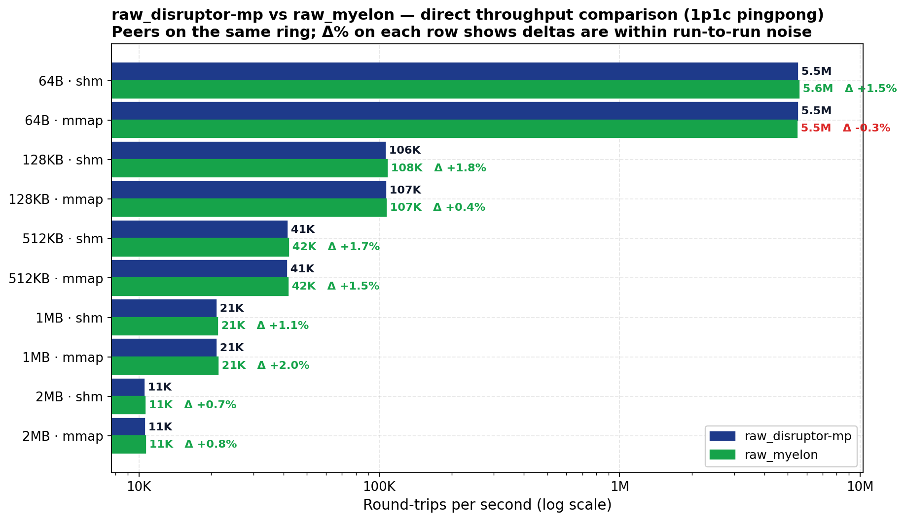

# disruptor-mp

`disruptor-mp` exists for one job: move fixed-size events between OS processes with as little coordination overhead as possible.

It extends the upstream [`disruptor`](https://crates.io/crates/disruptor) crate with a cross-process data plane. Producers and consumers in different OS processes coordinate through shared memory or a memory-mapped file using a fixed-size ring buffer and cache-line-padded sequence cursors.

Use this crate directly when you want the raw substrate only. If you need framing, codecs, typed zero-copy, or topology helpers, use [`myelon`](../myelon/) instead.

## What this crate provides

| Concern | Type | Purpose |
|---|---|---|
| Raw ring (SHM) | `SharedProducer<E>`, `SharedConsumer<E>` | Cross-process publish and consume of fixed-size events over a POSIX shared-memory segment. |
| Raw ring (mmap) | `MmapProducer<E>`, `MmapConsumer<E>` | Same model, backed by a memory-mapped file. |
| Builders | `build_shared_single_producer(...)`, `attach_shared_consumer(...)` | Construct producer and consumer endpoints with coordination and discovery. |
| Coordination | `CoordinationMode` | Decide when the producer considers peers attached. |
| Liveness | `RequiredConsumerLivenessConfig`, `RequiredConsumerFailureAction` | Turn a stalled required consumer into an observable failure or alert. |
| Naming | `portable_shm_segment_name(name)` | Derive a macOS-safe SHM segment name from an arbitrary label. |
| Observability | `disruptor_mp::observability::*` | Hot-path counters file plus optional exporter integration. |

`E` is your event type: `Copy + Default + 'static` with a stable layout.

What this crate does not try to do:

- variable-length framing
- typed serialization layers
- zero-copy archived reads over serialized bytes
- inference-specific topology helpers

## When to choose `disruptor-mp` vs `myelon`

| Need | Better entry point |
|---|---|
| Fixed-size `Copy` events over a raw ring buffer | `disruptor-mp` |
| Variable-length messages, fragmentation, reassembly | `myelon` |
| Codec-backed typed messages | `myelon` |
| Typed zero-copy reads of serialized payloads | `myelon` |

## Quick start

```toml
[dependencies]
disruptor-mp = "0.1.0-alpha.1"
```

Producer side:

```rust,no_run
use disruptor_mp::{
    build_shared_single_producer, portable_shm_segment_name, CoordinationMode,
};

#[derive(Copy, Clone, Default)]
#[repr(C)]
struct Event {
    sequence: u64,
}

let segment = portable_shm_segment_name("demo");
let mut producer = build_shared_single_producer::<Event>(&segment, 4096)
    .discover_consumer_with_prefix(1, "cp")
    .with_coordination(CoordinationMode::Immediate)
    .build_producer(Event::default)
    .expect("build producer");

producer.publish(|slot| slot.sequence = 42);
```

Consumer side, in a different process:

```rust,no_run
use disruptor_mp::attach_shared_consumer;

#[derive(Copy, Clone, Default)]
#[repr(C)]
struct Event {
    sequence: u64,
}

let mut consumer = attach_shared_consumer::<Event>("demo", 4096)
    .with_consumer_id("cp_0")
    .build_consumer()
    .expect("attach consumer");

while let Some(event) = consumer.try_consume_next_leased() {
    let _ = event.sequence;
}
```

## Required-consumer liveness

The base model is strict broadcast: the slowest consumer gates capacity. The optional liveness layer turns a stalled required consumer into a producer-visible timeout or graceful failure.

```rust,no_run
# fn main() -> Result<(), Box<dyn std::error::Error>> {
use disruptor_mp::{
    build_shared_single_producer, RequiredConsumerFailureAction,
    RequiredConsumerLivenessConfig,
};
use std::time::Duration;

let mut producer = build_shared_single_producer::<u64>("ring", 4096)
    .build_producer(Default::default)?;

producer.enable_required_consumer_liveness(RequiredConsumerLivenessConfig {
    required_consumer_ids: vec!["worker_0".into(), "worker_1".into()],
    startup_wait_timeout: Duration::from_secs(10),
    progress_timeout: Duration::from_secs(5),
    progress_check_interval: Duration::from_millis(100),
    shutdown_grace_period: Duration::from_secs(2),
    failure_action: RequiredConsumerFailureAction::GracefulShutdown,
    alert_hook: None,
});

producer.publish_managed(|slot| *slot = 42)?;
# Ok(()) }
```

The check is cold-path only. It runs while the producer is blocked on a required consumer, not on the steady-state fast path.

## Common entry points

- `build_shared_single_producer(...)`
- `attach_shared_consumer(...)`
- `SharedProducer`, `SharedConsumer`
- `MmapProducer`, `MmapConsumer`
- `portable_shm_segment_name(...)`
- `CoordinationMode`
- `RequiredConsumerLivenessConfig`

## Platform support

- Linux: officially supported
- macOS: officially supported
- Windows: unsupported

## Development

```bash
cargo test -p disruptor-mp --lib --tests
cargo test -p demos --examples --no-run
cargo test -p disruptor-mp --benches --no-run
make -C crates/perf-bench smoke
make -C crates/competitive-bench simple-smoke
```

## Benchmarks

Performance work lives in the dedicated bench crates:

- `crates/perf-bench` for the broad internal sweep
- `crates/competitive-bench` for the external-comparison contract

`raw_ring` (this crate's substrate) and `raw_myelon` (the same substrate re-exported through the `myelon` crate) measure identically across the matrix, confirming the re-export is zero-overhead:

<p align="center">
  
</p>

## License

Licensed under either of [Apache License, Version 2.0](../../LICENSE-APACHE) or [MIT license](../../LICENSE-MIT) at your option.
