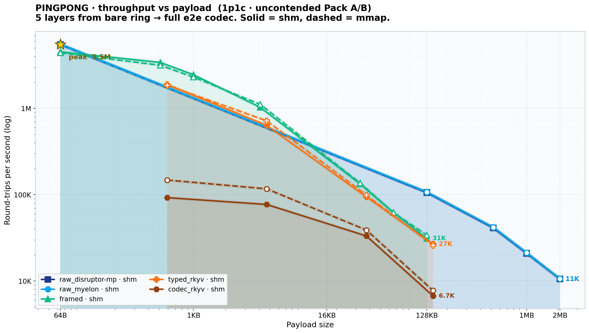
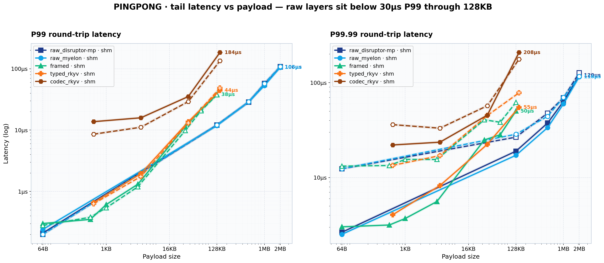

# myelon

`myelon` is the public transport crate built on top of `disruptor-mp`.

The design goal is simple:

- if the raw ring is enough, you should still be able to reach it through `myelon`
- if the raw ring is not enough, you should not have to assemble framing, typed transport, zero-copy access, topology helpers, and layout helpers yourself

That is why `myelon` re-exports the raw substrate from [`disruptor-mp`](../disruptor-mp/) and layers framing, codec-backed typed transport, typed zero-copy, topology helpers, and transport-layout helpers behind one dependency.

## Layer model

```text
Layer 3: typed zero-copy
  ZeroCopyCodec access over serialized payloads

Layer 2: typed codec transport
  owned encode/decode with bincode, rkyv, or flatbuffers

Layer 1: framed transport
  variable-length payloads, fragmentation, reassembly, message ids, flags

Layer 0: raw ring, re-exported from disruptor-mp
  SharedProducer/SharedConsumer (SHM)
  MmapProducer/MmapConsumer (mmap)
  builders, coordination, discovery, liveness, observability

Cross-cutting helpers:
  FixedTopology, WorkerCount, MyelonTransportLayout, config helpers
```

Each outer layer wraps the one below it. You only pay for the layers you use, and the raw substrate remains reachable through `myelon` without adding `disruptor-mp` as a second dependency.

Throughput and latency across the layer ladder over the same payload sweep (64 B → 2 MB):

<p align="center">
  
</p>

<p align="center">
  
</p>

## Pick a surface

| Need | Surface |
|---|---|
| Fixed-size `Copy` events over a cross-process ring buffer | `SharedProducer<E>` / `SharedConsumer<E>` and mmap equivalents |
| Variable-length byte messages with fragmentation and reassembly | `FramedTransportProducer<F>` / `FramedTransportConsumer<F>` |
| Typed messages with encode/decode | `TypedProducer<F>` / `TypedConsumer<F>` + `Codec` |
| Typed in-place reads of serialized payloads | `TypedProducer<F>` / `TypedConsumer<F>` + `ZeroCopyCodec` |
| Fixed scheduler / N-worker topology helpers | `FixedTopology`, `WorkerCount` |
| SHM naming and runner wiring helpers | `MyelonTransportLayout`, `MyelonTransportConfig`, `RunnerMyelonTransportConfig` |

If you are unsure, start with the highest-level surface that matches your data model and measure before stepping down.

## Quick start

```toml
[dependencies]
myelon = "0.1.0-alpha.1"
```

Raw ring example:

```rust,no_run
use myelon::{build_shared_single_producer, portable_shm_segment_name, CoordinationMode};

#[derive(Copy, Clone, Default)]
#[repr(C)]
struct Tick {
    ts_ns: u64,
    price: u64,
}

let segment = portable_shm_segment_name("ticks");
let mut producer = build_shared_single_producer::<Tick>(&segment, 4096)
    .discover_consumer_with_prefix(1, "cp")
    .with_coordination(CoordinationMode::Immediate)
    .build_producer(Tick::default)
    .expect("build producer");

producer.publish(|slot| {
    slot.ts_ns = 1;
    slot.price = 100;
});
```

Framed transport example:

```rust,no_run
# fn main() -> Result<(), Box<dyn std::error::Error>> {
use myelon::transport::{
    AlignedFixedFrame, FramedTransportConsumer, FramedTransportProducer, MyelonWaitStrategy,
};

type Frame = AlignedFixedFrame<1024>;

let mut producer = FramedTransportProducer::<Frame>::create("rpc", 4096)?;
producer.publish(b"hello", 1);

let mut consumer = FramedTransportConsumer::<Frame>::attach(
    "rpc",
    4096,
    MyelonWaitStrategy::BusySpin,
)?;
let (_kind, payload) = consumer.recv_message_blocking_owned();
let _ = payload;
# Ok(()) }
```

## Choosing a frame size

The framed transport uses const-generic frame types. You choose the payload capacity at compile time.

```rust
use myelon::transport::{AlignedFixedFrame, FixedFrame};

type Frame64K = FixedFrame<{ 64 * 1024 - 12 }>;
type Frame4K = FixedFrame<{ 4 * 1024 - 12 }>;
type ZcFrame = AlignedFixedFrame<{ 64 * 1024 - 16 }>;
```

| Choice | Effect |
|---|---|
| Larger frame payload | More bytes per slot, fewer messages per fixed memory budget, less fragmentation |
| Smaller frame payload | Tighter memory footprint, more fragmentation once payloads exceed slot capacity |
| Right-sized frame payload | Lowest overhead for the dominant payload class |

`64 KB` is a benchmark convention, not a magic value.

## Two senses of zero-copy

| Sense | Where | Meaning |
|---|---|---|
| Memory-level zero-copy | Raw ring | Borrow `&E` directly from the ring slot with no allocation or copy |
| Typed-format zero-copy | Typed transport + `ZeroCopyCodec` | Read archived or table-backed payloads in place from serialized bytes |

If your event is fixed-size and `Copy + repr(C)`, the raw ring is already the fastest zero-copy path.

## Required-consumer liveness

Every producer layer can opt into required-consumer liveness. This turns a silent stall into a producer-visible timeout or graceful shutdown path.

| Layer | Methods |
|---|---|
| Raw ring | `enable_required_consumer_liveness`, `publish_managed`, `publish_batch_managed` |
| Framed transport | `enable_required_consumer_liveness`, `publish_managed` |
| Typed transport | `enable_required_consumer_liveness`, `publish_managed` |

```rust,no_run
# fn main() -> Result<(), Box<dyn std::error::Error>> {
use myelon::{RequiredConsumerFailureAction, RequiredConsumerLivenessConfig};
use std::time::Duration;

# let mut producer: myelon::SharedProducer<()> = unimplemented!();
producer.enable_required_consumer_liveness(RequiredConsumerLivenessConfig {
    required_consumer_ids: vec!["worker_0".into(), "worker_1".into()],
    startup_wait_timeout: Duration::from_secs(10),
    progress_timeout: Duration::from_secs(5),
    progress_check_interval: Duration::from_millis(100),
    shutdown_grace_period: Duration::from_secs(2),
    failure_action: RequiredConsumerFailureAction::GracefulShutdown,
    alert_hook: None,
});

producer.publish_managed(|slot| {
    let _ = slot;
})?;
# Ok(()) }
```

The liveness check stays off the steady-state fast path. It runs only while the producer is blocked on a required consumer.

## Cargo features

| Feature | What it enables |
|---|---|
| default | Raw ring, framed transport, and the bincode codec path |
| `rkyv` | rkyv codec and typed zero-copy support |
| `flatbuffers` | flatbuffers codec and typed zero-copy support |
| `dst` | forwards DST test hooks for deterministic-simulation test lanes |

## Relationship to `disruptor-mp`

`disruptor-mp` is the raw substrate. `myelon` is the broader public crate.

- Depend on `myelon` if you want the higher transport layers available.
- Depend on `disruptor-mp` directly if you only need the raw substrate and want the smallest public surface.

The type identity is preserved across the re-export boundary.

## License

Licensed under either of [Apache License, Version 2.0](../../LICENSE-APACHE) or [MIT license](../../LICENSE-MIT) at your option.
