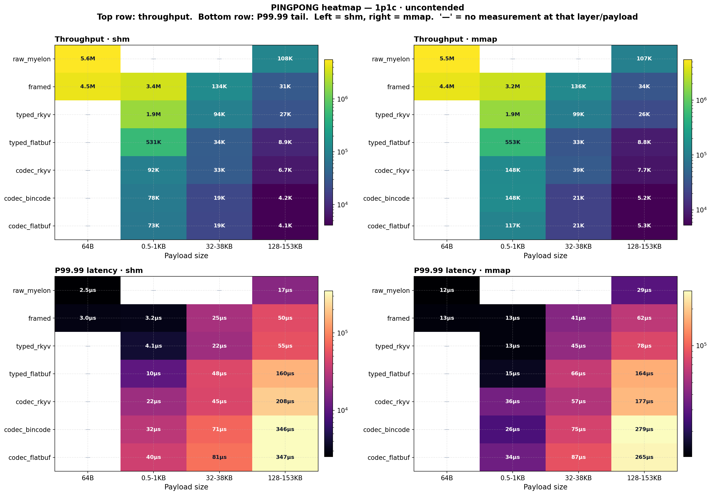
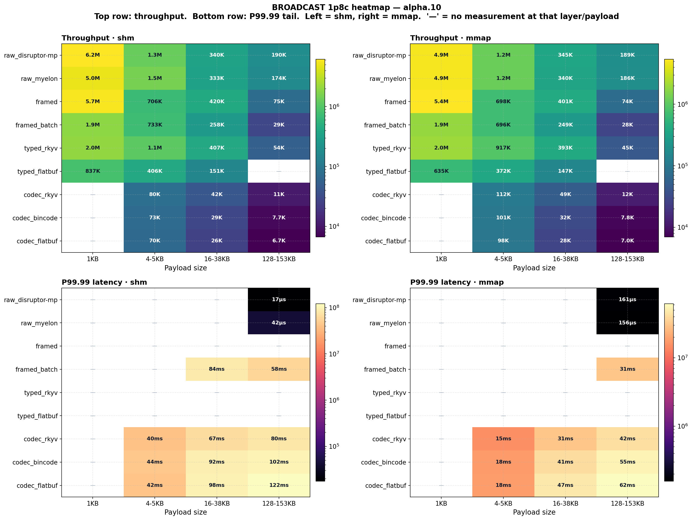
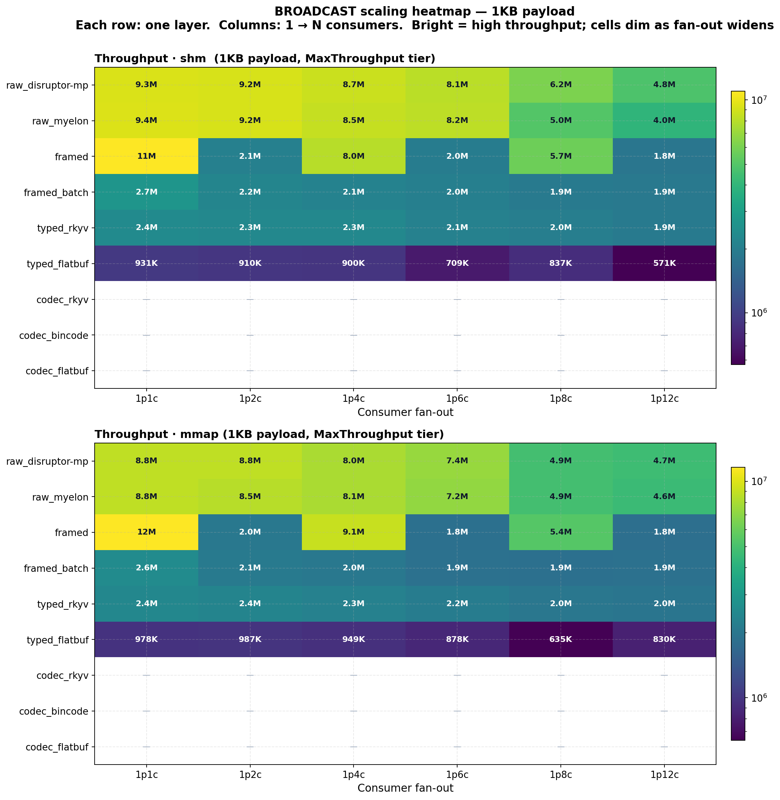

# perf-bench

> **Internal.** Not published to crates.io. Owns the broad internal sweep surface; the narrower external comparison surface lives in [`competitive-bench`](../competitive-bench/).

`perf-bench` exists to answer the internal question precisely: what exactly did we measure, on which transport layer, with which backend, under which pacing model?

It consolidates the repository's performance benchmarks for the [`disruptor-mp`](../disruptor-mp/) and [`myelon`](../myelon/) transport stacks into a small set of binaries that share one set of event types, payload generators, latency recorders, coordination primitives, and reporting code.

## Start here

If you are orienting to this crate, use this order:

- `make -C crates/perf-bench simple-smoke` for a fast exact-size sanity lane
- `make -C crates/perf-bench super-tiny` for the broad CI-style gate
- `perf-bench-signal` for signal-only work
- `perf-bench-pingpong` for `1p1c` transport lanes
- `perf-bench-broadcast` for `1pNc` transport lanes

The full tree and capability matrix below are for navigation once you already know which surface you need.

## Binaries

| Binary | Scenarios |
|---|---|
| `perf-bench-pingpong` | `1p1c` ping-pong. All four layers (`raw_ring`, `framed`, `codec`, `typed_zc`) × both backends (`shm`, `mmap`) × three modes (max-throughput, fixed-rate coordinated-omission-aware, low-overhead batch-timing). |
| `perf-bench-broadcast` | `1pNc` broadcast across the raw, framed, codec, typed zero-copy, wait-strategy, sweep, and layout families. `typed_zc` is exposed as a first-class alias over the dedicated typed zero-copy sweep family. |
| `perf-bench-signal` | Cache-line-sized signal events, no payload variation, raw layer only: pure hardware ceiling and true signal-latency lanes. |
| `perf-bench-repeatability` | Repeat a single configuration `N` times and emit canonical JSON for run-to-run variance analysis. |

## Capability matrix

| Dimension | Values |
|---|---|
| Layer | `raw_ring`, `raw_myelon`, `framed`, `codec`, `typed_zc` |
| Backend | `shm` (POSIX SHM), `mmap` (memory-mapped file) |
| Mode | `--throughput` (default), `--target-rate <ops/s>` (CO-aware fixed rate), `--batch-timing` (low-overhead) |
| Wait strategy | `--wait-strategy busyspin | spinloop | sleep | block` |
| Codec | `--codec bincode | rkyv | flatbuf` (Layer 2 / 3 only) |
| Fragmentation | `--frag` (64 KB fixed slots, multi-frame) / `--nofrag` (right-sized single-frame) |
| Coordination | Internal `UnifiedCoordination` (single SHM segment, 9 cache-line-padded atomics) for native lanes; external `BenchmarkCoordination` (5 separate cursor segments) for adapter lanes. Both styles run side-by-side. |
| Liveness / counters | `--enable-counters` to attach RFC-0040 hot-path counters; required-consumer liveness wired for parity benches. |
| Output | `--json`, `--json-canonical`, `--json-out PATH`, `--csv-out`, `--md-out`, `--tree` |

## Methodology notes

- Layer 1 framed benches use `myelon`'s leased receive path where available, so the reported cost is framing / fragmentation / reassembly overhead, not an avoidable owned-copy artifact.
- Layer 2 codec benches intentionally include owned decode cost.
- Layer 3 typed zero-copy benches intentionally exercise in-place access.
- Signal benches are a separate family from payload-carrying ping-pong or broadcast benches and should be interpreted separately.

## Layer hierarchy exercised in concrete benches

```text
        consumer-side checksum / decode
                  ▲
                  │  Layer 3: typed zero-copy via myelon::ZeroCopyCodec
                  │  Layer 2: owned decode via myelon::Codec (bincode/rkyv/flatbuf)
                  │  Layer 1: myelon::FramedTransport (multi-frame, msg_id, flags)
                  │  Layer 0: disruptor_mp::SharedProducer/Consumer (raw ring)
                  ▼
        producer publishes raw struct or framed bytes
```

Each scenario in `perf-bench` is named after the layer + backend it exercises. For example, `layers/raw/disruptor_mp/pingpong_shm.rs` means raw layer, SHM backend, ping-pong shape. The directory tree mirrors the benchmark surface so you can read the filesystem and understand what the bench measures.

## File / directory structure

The source tree is organized by benchmark surface, with the reusable
plumbing split out into `infra/` and the scenario implementations split
out into `layers/`.

```text
crates/perf-bench/
├── Cargo.toml
├── Makefile
├── output/                                  # Local bench output (gitignored)
├── scripts/                                 # Small helper scripts and validation gates.
├── src/
│   ├── lib.rs                               # Crate root: cli + infra + layers + bench_support.
│   ├── bench_payload.fbs                    # FlatBuffers schema used by generated payloads.
│   ├── bin/                                 # Consolidated bench binaries.
│   │   ├── pingpong.rs                      # `perf-bench-pingpong`
│   │   ├── broadcast.rs                     # `perf-bench-broadcast`
│   │   ├── signal.rs                        # `perf-bench-signal`
│   │   └── repeatability.rs                 # `perf-bench-repeatability`
│   ├── bench_support/                       # Shared event types and helper data reused by benches.
│   │   ├── common.rs
│   │   ├── table.rs
│   │   └── mod.rs
│   ├── cli/                                 # CLI arg parsing + scenario specs.
│   │   ├── mod.rs
│   │   ├── pingpong.rs
│   │   ├── myelon_pingpong.rs
│   │   ├── raw_ring.rs
│   │   ├── codec.rs
│   │   ├── framed.rs
│   │   ├── wait_strategy.rs
│   │   ├── layout.rs
│   │   └── sweeps/
│   │       ├── mod.rs
│   │       ├── common.rs
│   │       ├── framed.rs
│   │       ├── layers.rs
│   │       ├── monster.rs
│   │       └── typed_zero_copy.rs
│   ├── layers/
│   │   ├── mod.rs
│   │   ├── raw/                             # Layer 0: direct ring, no framing.
│   │   │   ├── mod.rs
│   │   │   ├── disruptor_mp/
│   │   │   │   ├── mod.rs
│   │   │   │   ├── pingpong_{shm,mmap}.rs
│   │   │   │   ├── broadcast_{shm,mmap}.rs
│   │   │   │   └── wait_strategy_{shm,mmap}.rs
│   │   │   └── myelon/
│   │   │       ├── mod.rs
│   │   │       ├── pingpong_{shm,mmap}.rs
│   │   │       ├── broadcast_{shm,mmap}.rs
│   │   │       └── wait_strategy_{shm,mmap}.rs
│   │   ├── framed_myelon/                   # Layer 1+ families.
│   │   │   ├── mod.rs
│   │   │   ├── frag/
│   │   │   │   ├── mod.rs
│   │   │   │   ├── pingpong_{shm,mmap}.rs
│   │   │   │   └── broadcast_{shm,mmap}.rs
│   │   │   ├── nofrag/
│   │   │   │   ├── mod.rs
│   │   │   │   └── pingpong_{shm,mmap}.rs
│   │   │   ├── codec/
│   │   │   │   ├── mod.rs
│   │   │   │   ├── pingpong_{shm,mmap}.rs
│   │   │   │   ├── {shm,mmap}.rs            # broadcast codec lanes
│   │   │   │   ├── nofrag_{shm,mmap}.rs
│   │   │   │   └── payloads.rs
│   │   │   └── typed_zc/
│   │   │       ├── mod.rs
│   │   │       ├── pingpong_{shm,mmap}.rs
│   │   │       └── support.rs
│   │   ├── sweeps/
│   │   │   ├── mod.rs
│   │   │   ├── myelon_layers.rs
│   │   │   ├── myelon_framed_sweep.rs
│   │   │   ├── monster_sweep_shm.rs
│   │   │   ├── monster_sweep_mmap.rs
│   │   │   ├── typed_zero_copy_sweep.rs
│   │   │   └── nofrag_all.rs
│   │   └── layout.rs                        # Memory-layout timing validation gate.
│   ├── infra/
│   │   ├── mod.rs
│   │   ├── bench.rs
│   │   ├── config.rs
│   │   ├── child_runner.rs
│   │   ├── backend.rs
│   │   ├── allocation.rs
│   │   ├── competitors.rs
│   │   ├── discovery.rs
│   │   ├── events.rs
│   │   ├── latency.rs
│   │   ├── launch.rs
│   │   ├── liveness.rs
│   │   ├── naming.rs
│   │   ├── process.rs
│   │   ├── repeatability.rs
│   │   ├── signal_counters.rs
│   │   ├── signal_latency.rs
│   │   ├── coordination/
│   │   │   ├── mod.rs
│   │   │   ├── external.rs
│   │   │   └── native.rs
│   │   └── output/
│   │       ├── mod.rs
│   │       ├── dir.rs
│   │       ├── log.rs
│   │       ├── reporting.rs
│   │       ├── results.rs
│   │       └── report/
│   │           ├── mod.rs
│   │           ├── model.rs
│   │           ├── layout.rs
│   │           ├── emit.rs
│   │           ├── adapt.rs
│   │           ├── csv.rs
│   │           ├── json.rs
│   │           ├── markdown.rs
│   │           ├── table.rs
│   │           ├── views.rs
│   │           └── divan_tree.rs
│   └── generated/
│       └── bench_payload_generated.rs
└── tests/
```

### Why this layout

- `layers/` holds the scenario implementations that actually touch
  `disruptor-mp` and `myelon`.
- `layers/sweeps/` holds the larger matrix drivers that compose many
  lower-level cases into one benchmark family.
- `infra/coordination/` splits the native one-segment coordination path
  from the legacy external multi-cursor pattern.
- `infra/output/report/` keeps renderers and output adaptation out of the
  hot-path benchmark code.
- `bench_support/` holds shared event types and helper data consumed by
  both `perf-bench` and `competitive-bench`.

## Quick start

The bench commands below use `--profile competitive` (max-perf, `panic = "abort"`, stripped) — bench-fairness defaults, not production. For production builds use `release` or `prod-max`. See the workspace README's *Validation and benchmarks* section.

```bash
# Default 1p1c ping-pong: raw ring, SHM, 64-byte payload.
cargo run -p perf-bench --profile competitive --bin perf-bench-pingpong -- \
    --layer raw_ring --backend shm

# RFC-0040 observability counters on, in a separate scenario from the default path.
cargo run -p perf-bench --profile competitive --bin perf-bench-pingpong -- \
    --layer raw_ring --backend shm --enable-counters

# Layer 2 codec with rkyv.
cargo run -p perf-bench --profile competitive --bin perf-bench-pingpong -- \
    --layer codec --backend shm --codec rkyv

# Layer 3 typed zero-copy.
cargo run -p perf-bench --profile competitive --bin perf-bench-pingpong -- \
    --layer typed_zc --backend shm --codec flatbuf

# 1p4c broadcast with fixed-rate coordinated-omission-aware mode.
cargo run -p perf-bench --profile competitive --bin perf-bench-broadcast -- \
    --layer raw_ring --backend mmap --consumers 4 --target-rate 1000000

# Hardware ceiling: signal-only events.
cargo run -p perf-bench --profile competitive --bin perf-bench-signal -- \
    --backend shm --consumers 1 --events 10000000
```

## Fast lanes

```bash
make -C crates/perf-bench simple-smoke
make -C crates/perf-bench super-tiny
```

- `simple-smoke`
  - exact-size sanity lane
  - signal + raw ping-pong + raw broadcast
  - raw ping-pong starts at `64B` total event size because the ping-pong event layout carries a `64B` structural header
  - raw broadcast `--size` is the logical event request; reports expose the physical aligned slot bytes separately when `32B` or `144B` round up
- `super-tiny`
  - broader OSS/CI gate
  - `100` warmup + `1000` measured messages/events where the scenario family exposes explicit warmup/message-count controls
  - covers signal, exact-size raw lanes, representative higher-layer ping-pong, representative higher-layer broadcast, wait-strategy, sweeps, and layout

## Sample output

The bench emits JSON per scenario plus pre-rendered charts. Examples:

Pingpong throughput across the layer × payload × backend matrix:

<p align="center">
  
</p>

Broadcast throughput at 1p8c, payload-swept:

<p align="center">
  
</p>

Broadcast consumer scaling (1p1c through 1p12c):

<p align="center">
  
</p>

## Relationship to other crates

- Wraps and measures [`disruptor-mp`](../disruptor-mp/) and [`myelon`](../myelon/) without modifying them.
- The `bench_support/` module is consumed by [`competitive-bench`](../competitive-bench/), so the same `BenchmarkEvent<SIZE>` flows through native and external lanes.
- Workspace-level runnable examples for users who do not need a full sweep live in [`../../examples/`](../../examples/).

## License

Licensed under either of [Apache License, Version 2.0](../../LICENSE-APACHE) or [MIT license](../../LICENSE-MIT) at your option.
